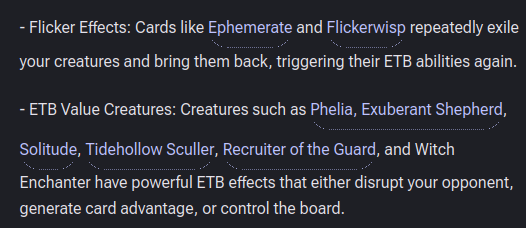

Rubric descriptions need to be generated at a per-role level when the card is scored against the rubric for a given role - as well - these role-level descriptions will be used when generating the overall-level description.

Decks must have a north star/goal before cards can be evaluated. 

 card previews are formatted strangely - should not have rounded button-like effet - just an underline

AI-generated Descriptions are too verbose and need to follow a specific schema:
<markdown>
# Overview
[1-sentence overview + win condition]. [2-sentences on synergies and interactions]. [1-sentence on weaknesses].

# Gameplan
- Turns 1-3 - [...]
- Midgame - [...]
- Lategame - [...]
</markdown>

Project needs to be reorganized to be either feature/domain-based - e.g. (example just demonstrates structure - not actual desired filenames)

app/
  main.py
  core/
    config.py
    security.py
  db/
    session.py
  modules/
    users/
      router.py
      schemas.py
      models.py
      service.py
      repository.py
    reflections/
      router.py
      schemas.py
      models.py
      service.py
      repository.py
    sessions/
      router.py
      schemas.py
      models.py
      service.py
      repository.py

db i/o should be in its own layer via DAOs
controllers should be skinny
business logic should live in services

In text view mode, cards should be listed within a group, but groups should be in columns w/ reactive wrapping

there should be no max width for t he chat pane

embedding-search based functionality should be removed from the UI and from the agent for now. Do not delete the embedding generation code or db yet, though. Embedding searches are ineffective for searching for good cards. instead, the agent needs to have a strong understanding of how to use the scryfall search api, and needs to be able to score an individual card by its oracle_id against a given deck_id, which will perform the role + scoring steps we do elsewhere. again, rubric scores should be cached by deck versoin + oracle id